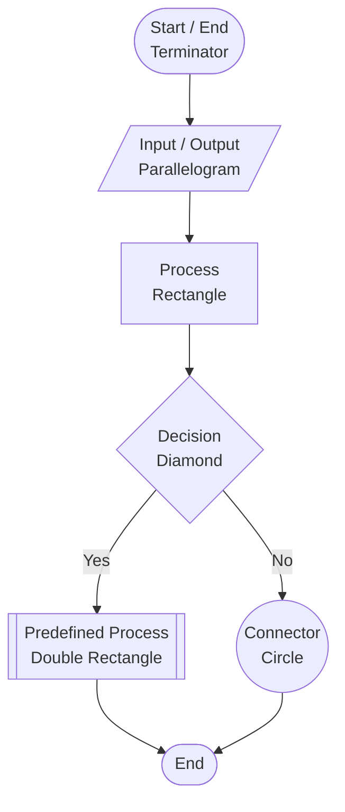

What is Flowchart?

Ans:- "A flowchart is a diagram that represents the step-by-step flow of a process or program using different symbols and arrows."

## Flowchart Components

### Component Names

| Symbol | Name | Purpose |
|---|---|---|
| Rounded shape | Terminator | Shows the start or end of a flowchart |
| Parallelogram | Input / Output | Receives or displays data |
| Rectangle | Process | Represents an action or instruction |
| Diamond | Decision | Checks a condition and creates branches |
| Circle | Connector | Joins parts of a flowchart |
| Arrow | Flow line | Shows the direction of the process |

