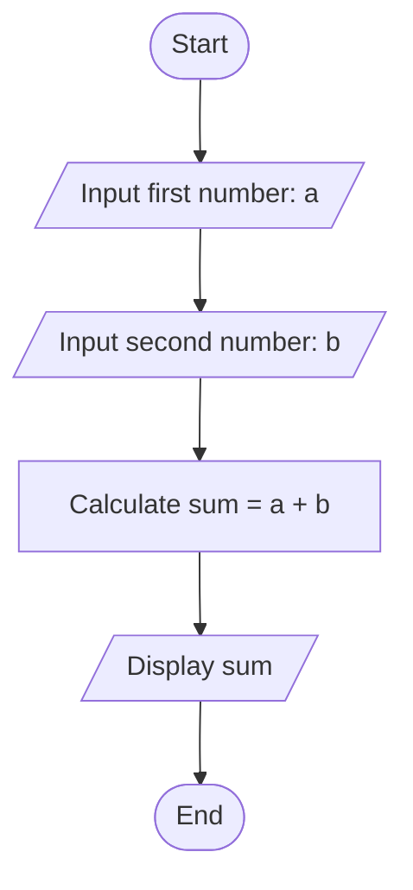

# sum of 2 number #

## input ##

first number , a 
second number , b 

## output ## 

sum of a & b 

# flowchart of the sum of 2 number # 

# PSEDUCODES #

1. start 
2. input number, a&b 
3. calcute the sum , a+b 
4. Print sum 
5. Exit 
