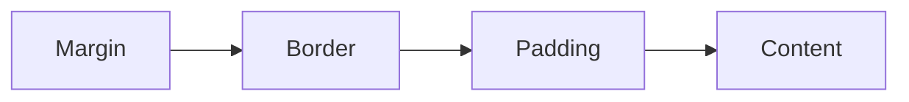
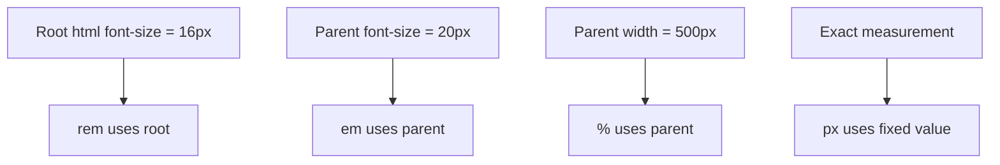
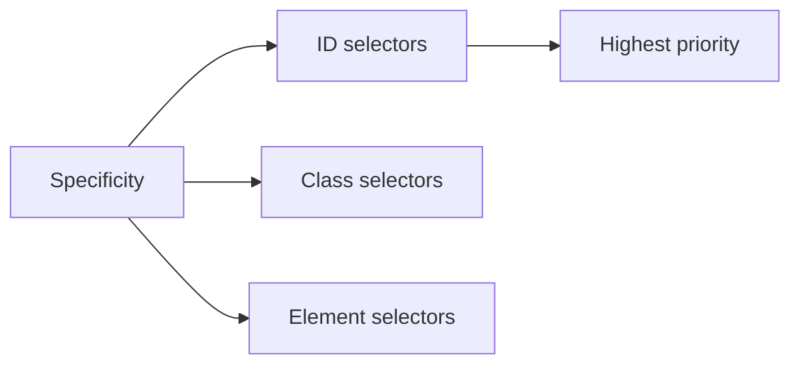
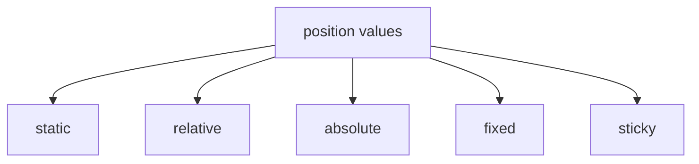
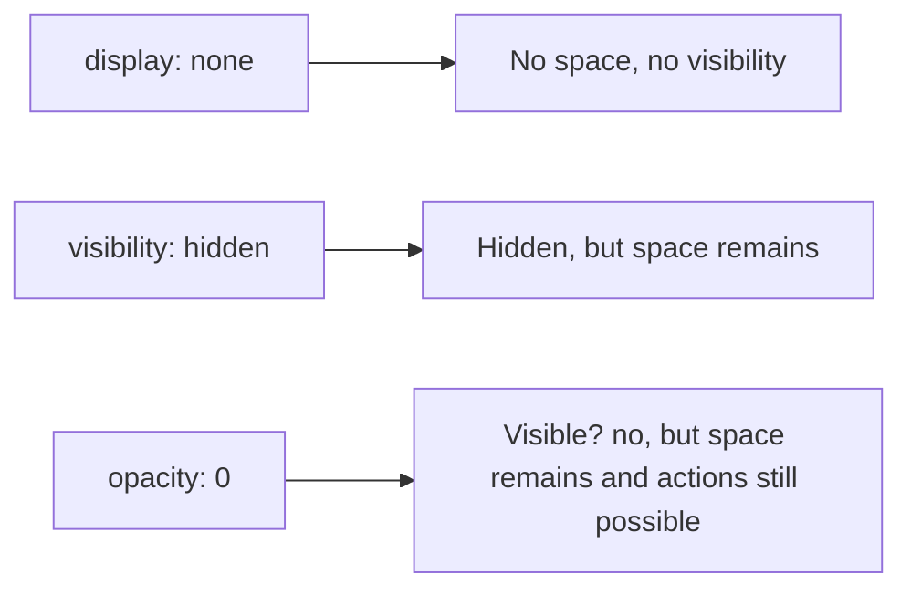
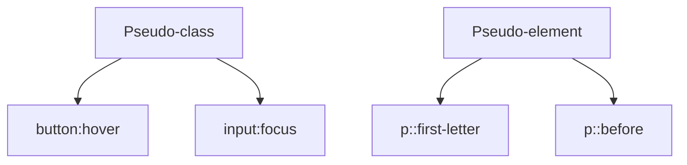
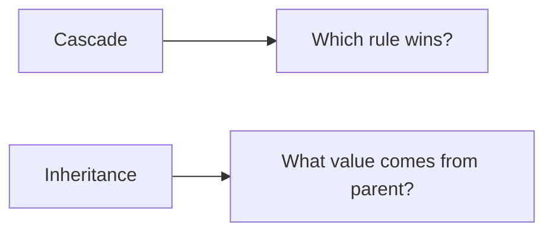

# CSS Interview Questions

This file contains simple, interview-ready answers in the format:

- Question
- 3-line answer
- Code snippet
- Daily life example
- Extra concept if needed

---

## 7. Explain the CSS box model. What does `box-sizing: border-box` change?

### Question
Explain the CSS box model. What does `box-sizing: border-box` change?

### 3-line answer
The CSS box model describes how an element is sized and spaced: content, padding, border, and margin. Width and height usually apply to the content box only, unless changed by `box-sizing`. `box-sizing: border-box` makes the total element size include padding and border, which makes layout easier and more predictable.

### Code snippet
```css
.box {
  width: 200px;
  padding: 20px;
  border: 10px solid #333;
  box-sizing: border-box;
}
```

### Daily life example
Think of a box as a gift packaging box. The content is the gift inside, padding is the bubble wrap, border is the outer wrapper, and margin is the space left around it in the room. With `border-box`, the box's total size stays fixed even when you add more packing material.

### Diagram


### Extra note
Without `border-box`:
```css
.box {
  width: 200px;
  padding: 20px;
  border: 10px solid red;
}
```
Total width becomes more than 200px because padding + border adds extra space.

---

## 8. `em` vs `rem` vs `px` vs `%` — when do you use each?

### Question
`em` vs `rem` vs `px` vs `%` — when do you use each?

### 3-line answer
`px` is a fixed pixel value and is good for exact sizes. `em` is relative to the parent element's font size, while `rem` is relative to the root font size. `%` is relative to the parent container or parent size, often used for width, height, and layout percentages.

### Code snippet
```css
html {
  font-size: 16px;
}

.parent {
  font-size: 20px;
}

.child {
  font-size: 1.5em; /* 30px if parent is 20px */
  width: 50%;
  padding: 1rem; /* 16px */
  margin: 10px;
}
```

### Daily life example
- `px` = fixed ruler measurement
- `rem` = based on the main page size
- `em` = based on the current container size
- `%` = based on the space available in the parent

### Diagram


### Extra note
Use `rem` for consistent typography across a project. Use `em` for component-level scaling based on parent size. Use `px` only when precise fixed values are needed. Use `%` for responsive layouts.

---

## 9. Explain CSS specificity. Calculate specificity for a given selector.

### Question
Explain CSS specificity. Calculate specificity for a given selector.

### 3-line answer
CSS specificity decides which style wins when multiple rules apply to the same element. More specific selectors override less specific ones. Specificity is calculated as `a, b, c` = ID, class/attribute/pseudo-class, type/pseudo-element.

### Code snippet
```css
#nav .item.active {
  color: red;
}

nav ul li a {
  color: blue;
}
```

### Specificity calculation
- `#nav` = 1 ID → `(1,0,0)`
- `.item` = 1 class → `(0,1,0)`
- `.active` = 1 class → `(0,1,0)`
- `nav ul li a` = 0 IDs, 0 classes, 4 tags → `(0,0,4)`

So:
```text
#nav .item.active  ->  (1,2,0)
nav ul li a        ->  (0,0,4)
```
The first rule wins because `(1,2,0)` is more specific than `(0,0,4)`.

### Daily life example
Think of CSS like a school rulebook. A rule written for one exact student ID (`#id`) is stronger than a general rule for all students of a class (`.class`).

### Diagram


### Extra note
Inline styles have even higher priority than regular stylesheet rules, but they are usually avoided for maintainability.

---

## 10. All `position` values explained — with a use case for each.

### Question
All `position` values explained — with a use case for each.

### 3-line answer
`position` controls how an element is placed in the layout. `static` is default and follows normal flow, `relative` shifts from its normal position, `absolute` positions relative to the nearest positioned ancestor, `fixed` stays fixed in the viewport, and `sticky` stays in flow until a scroll threshold is reached.

### Code snippet
```css
.box {
  position: relative;
  top: 10px;
  left: 20px;
}

.child {
  position: absolute;
  top: 0;
  right: 0;
}

.navbar {
  position: sticky;
  top: 0;
}
```

### Use cases
- `static`: normal page flow
- `relative`: nudge an element slightly without affecting layout
- `absolute`: place a tooltip or floating badge over a card
- `fixed`: sticky header or back-to-top button
- `sticky`: navbar that sticks to top when scrolling
- `inherit`: inherit a parent position value

### Daily life example
A page is like a room arrangement:
- `static` = normal furniture placement
- `relative` = move one chair a little to the side
- `absolute` = place a lamp exactly on a table
- `fixed` = clock mounted on the wall that stays in place
- `sticky` = a note that stays visible only after you scroll enough

### Diagram


### Extra note
`static` is the default value and does not require positioning rules. `absolute` and `fixed` remove the element from normal flow unless carefully placed.

---

## 11. `visibility: hidden` vs `display: none` vs `opacity: 0`

### Question
What is the difference between `visibility: hidden`, `display: none`, and `opacity: 0`?

### 3-line answer
`display: none` removes the element completely from the page layout. `visibility: hidden` hides the element but keeps the space reserved. `opacity: 0` makes the element transparent but still occupies space and can still be clicked or focused.

### Code snippet
```css
.hidden-box {
  visibility: hidden;
}

.removed-box {
  display: none;
}

.transparent-box {
  opacity: 0;
}
```

### Daily life example
- `display: none` = removing a chair from the room completely
- `visibility: hidden` = placing a chair behind a curtain, still taking space in the room
- `opacity: 0` = a glass chair that is invisible but still physically there

### Diagram


### Extra note
If you want an element to be hidden but still not take up space, use `visibility: hidden`. If you want it gone completely, use `display: none`.

---

## 12. Pseudo-class vs pseudo-element — give examples.

### Question
What is a pseudo-class and a pseudo-element? Give examples.

### 3-line answer
A pseudo-class selects an element based on its state, while a pseudo-element styles a specific part of an element. Pseudo-classes are used for states like hover and focus, while pseudo-elements are used for parts like first letter or before content.

### Code snippet
```css
button:hover {
  background-color: blue;
  color: white;
}

input:focus {
  border: 2px solid green;
}

p::first-letter {
  font-size: 2rem;
  color: red;
}

p::before {
  content: "Note: ";
  color: gray;
}
```

### Daily life example
A button becoming blue when the mouse is over it is like a pseudo-class. Making the first letter of a paragraph bigger is like a pseudo-element, because you are styling a part of the text, not the whole paragraph.

### Diagram


### Extra note
Use `:` for pseudo-classes and `::` for pseudo-elements in modern CSS.

---

## 13. What is the cascade? How is inheritance different from the cascade?

### Question
What is the cascade? How is inheritance different from the cascade?

### 3-line answer
The cascade is the CSS rule that decides which styles win when multiple rules match the same element. Inheritance means some properties are passed from a parent element to its children automatically. The cascade decides priority among conflicting styles, while inheritance decides default values coming from parent to child.

### Code snippet
```css
body {
  color: black;
  font-size: 16px;
}

.card {
  color: blue;
}

.card .title {
  color: red;
}
```

### Example explanation
- `body` gives a default color and font size.
- `.card` changes the child text color to blue.
- `.card .title` is more specific and may override it.
- The inherited value from `body` is used only if no more specific rule is applied.

### Daily life example
Think of a family:
- Inheritance = a parent gives a default trait to children.
- Cascade = when two family members give different instructions, the more important one wins.

### Diagram


### Extra note
Three big factors in the cascade are:
1. Source order
2. Specificity
3. Importance (`!important`)

---

## Quick revision points

- CSS box model = content + padding + border + margin.
- `box-sizing: border-box` keeps total width fixed.
- `px` = fixed, `em` = parent, `rem` = root, `%` = parent-relative.
- Specificity decides which CSS rule wins.
- `position` values define placement rules in layout.
- `display: none` removes from layout, `visibility: hidden` keeps space, `opacity: 0` hides visually but still active.
- Pseudo-class = state, pseudo-element = part of element.
- Cascade decides conflict resolution; inheritance gives default values.

---

## One-line interview answer summary

CSS works by styling the box model, using relative units and specificity rules, controlling layout with positioning, and resolving conflicts using the cascade while inheriting some properties from parent elements.
