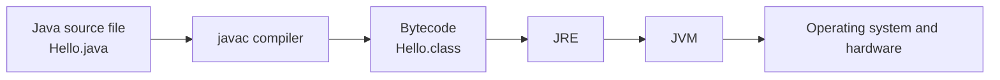
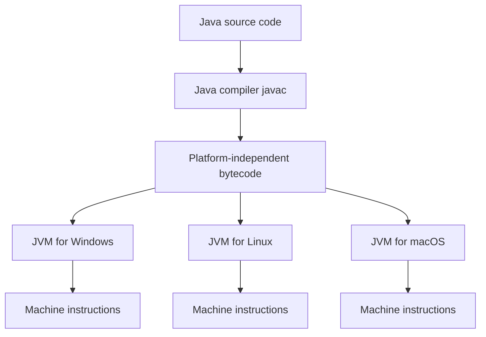
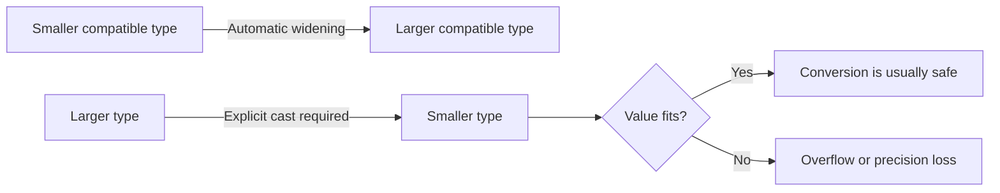
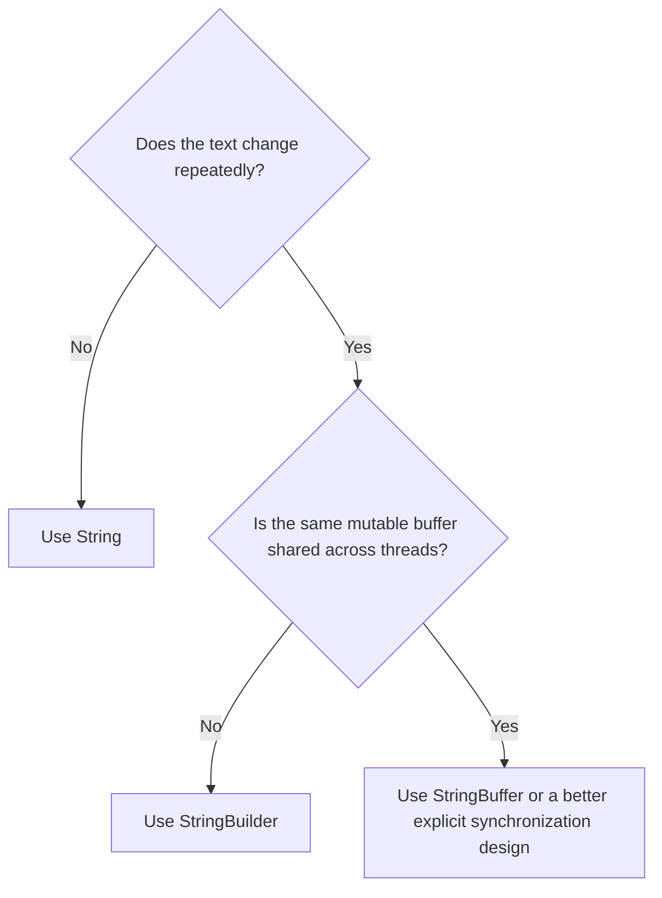
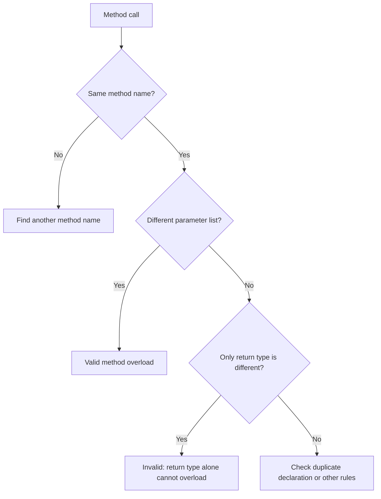
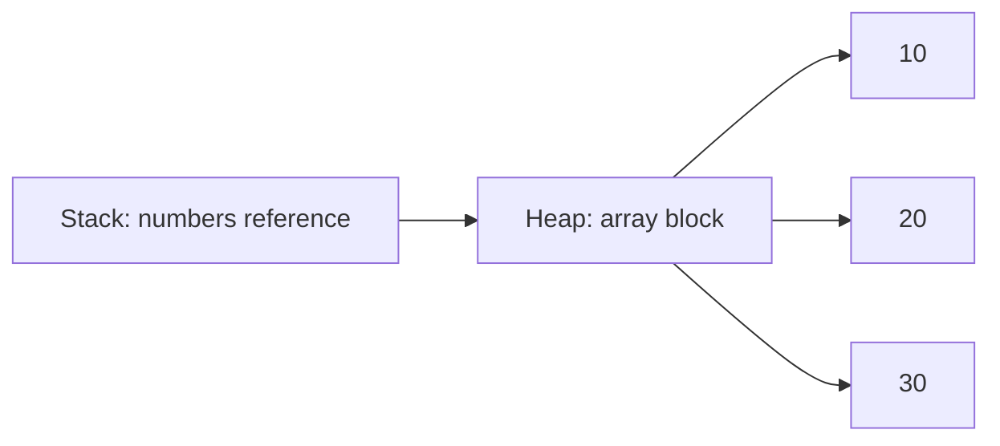

# Java Core Interview Questions

This guide covers eight common Java interview questions in simple language. Learn the short answer first, then use the explanation and example to build understanding.

## 1. What is the difference between JDK, JRE, and JVM?

### Short answer

- **JDK (Java Development Kit):** Used to develop, compile, debug, and run Java programs.
- **JRE (Java Runtime Environment):** Used to run Java programs. It contains the JVM and Java class libraries.
- **JVM (Java Virtual Machine):** Executes Java bytecode and provides the environment in which a Java program runs.

### Relationship

```text
JDK = JRE + Development tools
JRE = JVM + Java class libraries
JVM = Bytecode execution engine
```

### Important JDK tools

- `javac`: Compiles `.java` source code into `.class` bytecode.
- `java`: Starts the JVM and runs a compiled class.
- `javadoc`: Generates documentation.
- `jdb`: Java debugger.

### Execution flow



### Easy memory trick

```text
JDK -> Develop
JRE -> Run
JVM -> Execute
```

The JVM is platform-specific, but Java bytecode is platform-independent. A different operating system uses its own JVM implementation to execute the same bytecode.

---

## 2. Is Java platform-independent? What is bytecode?

### Is Java platform-independent?

Yes. Java is called **platform-independent** because the same compiled Java bytecode can run on different operating systems, such as Windows, Linux, and macOS, as long as a compatible JVM is installed.

Java follows the idea:

```text
Write Once, Run Anywhere (WORA)
```

Java is not completely independent of every platform because the JVM itself must be installed for the target platform. The important point is that the Java program does not need to be recompiled for each operating system in normal use.

### What is bytecode?

**Bytecode** is the intermediate, platform-neutral code produced by the Java compiler. It is stored in a `.class` file and is executed by the JVM.

Example:

```text
Hello.java --javac--> Hello.class --JVM--> Program output
```

### Why bytecode makes Java portable

1. A developer writes source code in a `.java` file.
2. `javac` compiles it into bytecode.
3. The same bytecode can be copied to another operating system.
4. That operating system's JVM translates or compiles the bytecode for its hardware.



### Interview distinction

- **Source code:** Human-readable Java code.
- **Bytecode:** JVM-readable intermediate code.
- **Machine code:** CPU-specific instructions.

---

## 3. What are the eight primitive types and their sizes? Primitive vs reference type

### Eight primitive data types

| Type | Size | Range or purpose |
|---|---:|---|
| `byte` | 8 bits (1 byte) | -128 to 127 |
| `short` | 16 bits (2 bytes) | -32,768 to 32,767 |
| `int` | 32 bits (4 bytes) | -2^31 to 2^31 - 1 |
| `long` | 64 bits (8 bytes) | -2^63 to 2^63 - 1 |
| `float` | 32 bits (4 bytes) | Decimal values, single precision |
| `double` | 64 bits (8 bytes) | Decimal values, double precision |
| `char` | 16 bits (2 bytes) | One UTF-16 character, `\u0000` to `\uffff` |
| `boolean` | Not precisely specified by the Java language | `true` or `false` |

Java guarantees the value range for `boolean`, but the language specification does not define one exact storage size for it. In interview answers, it is often described as approximately 1 bit logically, but do not claim that Java always uses exactly 1 bit in memory.

### Example

```java
byte smallNumber = 100;
int population = 1_000_000;
long distance = 9_000_000_000L;
float price = 19.99f;
double pi = 3.1415926535;
char grade = 'A';
boolean isJavaFun = true;
```

### Primitive types vs reference types

| Feature | Primitive type | Reference type |
|---|---|---|
| Stores | A direct value | A reference to an object |
| Examples | `int`, `double`, `char`, `boolean` | `String`, arrays, objects, `Integer` |
| Methods | Does not have methods | Objects provide methods |
| Default field value | Numeric `0`, `false`, `\\u0000` | `null` |
| Can be `null`? | No | Yes, unless restricted by another tool or design |
| Comparison with `==` | Compares values | Usually compares object references |
| Memory behavior | Usually efficient and simple | Refers to an object managed by the JVM |

```java
int first = 10;
int second = 10;
System.out.println(first == second); // true

String firstName = new String("Java");
String secondName = new String("Java");
System.out.println(firstName == secondName); // false
```

A reference variable does not necessarily contain the complete object itself; it identifies where the object can be found.

---

## 4. What is type casting? Implicit vs explicit casting

**Type casting** means converting a value from one data type to another compatible data type.

There are two main forms.

### A. Implicit casting: widening conversion

Implicit casting happens automatically when a smaller compatible type is converted to a larger compatible type. It is generally safe because the larger type can represent every value of the smaller type.

```text
byte -> short -> int -> long -> float -> double
```

```java
int number = 25;
double value = number; // implicit widening: int to double
System.out.println(value); // 25.0
```

### B. Explicit casting: narrowing conversion

Explicit casting is required when converting a larger type to a smaller type. Java requires the programmer to acknowledge the possible loss of information.

```java
double price = 99.99;
int wholePrice = (int) price;
System.out.println(wholePrice); // 99
```

The decimal part is discarded; Java does not round the value.

### Where can data loss happen?

Data loss can happen during narrowing conversions:

- Decimal part may be discarded when `double` or `float` becomes an integer.
- A value may overflow when a large integer becomes a smaller integer type.
- Precision may be lost when converting between floating-point types or from `long` to `float`.
- `char` conversion can change the character when the numeric value is not in the valid character range.

```java
int large = 130;
byte small = (byte) large;
System.out.println(small); // -126 due to overflow
```

### Casting flow



### Important note

Casting changes the type used for an expression; it does not change the original variable's declared type.

---

## 5. Difference between `==` and `.equals()`

### `==` operator

- For primitive values, `==` compares the actual values.
- For reference types, `==` compares whether two references point to the same object.

### `.equals()` method

- `.equals()` is a method used to compare object content when the class provides a suitable implementation.
- `String` overrides `.equals()` to compare character content.

### String example

```java
String first = new String("Java");
String second = new String("Java");

System.out.println(first == second);       // false: different objects
System.out.println(first.equals(second));  // true: same text
```

### String pool example

```java
String first = "Java";
String second = "Java";

System.out.println(first == second);       // true in this example
System.out.println(first.equals(second));  // true
```

Both literals normally refer to the same pooled String object. Do not rely on `==` for comparing String content. Use `.equals()` instead.

```java
if (first.equals(second)) {
    System.out.println("The strings contain the same text.");
}
```

For a possibly null String, put the known value first:

```java
if ("Java".equals(input)) {
    System.out.println("Input is Java");
}
```

### Quick rule

```text
Primitive values -> ==
String or object content -> .equals()
Object identity -> ==
```

---

## 6. Why are Strings immutable? What is the String pool?

### What does immutable mean?

An immutable object cannot be changed after it is created. The `String` object remains unchanged when an operation appears to modify it; the operation creates a new String instead.

```java
String language = "Java";
language.concat(" Programming");
System.out.println(language); // Java

language = language.concat(" Programming");
System.out.println(language); // Java Programming
```

The first `concat` creates a new String, but its result was not assigned. The original `language` object stayed unchanged.

### Why are Strings immutable?

1. **Security:** Strings are used for file paths, URLs, class names, database connections, and user credentials. Changing them after validation could create security problems.
2. **String pool sharing:** Many variables can safely share the same String object because nobody can modify it.
3. **Thread safety:** Immutable objects can be shared between threads without synchronization for their contents.
4. **Hashing:** A String's hash code can be cached safely. This makes Strings reliable keys in `HashMap` and members of `HashSet`.
5. **Predictable behavior:** The value cannot unexpectedly change after it has been passed to another method.

### What is the String pool?

The **String pool** is a special area managed by the JVM that stores one shared instance of identical String literals. This saves memory and avoids creating duplicate objects.

```java
String a = "Hello";
String b = "Hello";
String c = new String("Hello");
```

Conceptually:

```text
String pool:
    "Hello" <--- a
                  b

Heap:
    new String("Hello") <--- c
```

Therefore:

```java
System.out.println(a == b);       // true: same pooled object
System.out.println(a == c);       // false: c refers to another object
System.out.println(a.equals(c));  // true: same content
```

`new String("Hello")` explicitly creates another String object and should generally be avoided unless that separate object is specifically required.

### `intern()`

`intern()` returns the canonical pooled representation of a String:

```java
String a = new String("Java");
String b = a.intern();
String c = "Java";

System.out.println(b == c); // true
```

Use `equals()` for normal content comparison. `intern()` should be used thoughtfully because adding many dynamic strings to the pool can increase memory usage.

### Immutability diagram

```mermaid
flowchart LR
    A[String s = "Java"] --> B[String object: Java]
    B --> C[s.concat(" SE")]
    C --> D[New String object: Java SE]
    B --> E[Original object remains Java]
```

---

## 7. `String` vs `StringBuilder` vs `StringBuffer`

| Feature | `String` | `StringBuilder` | `StringBuffer` |
|---|---|---|---|
| Mutability | Immutable | Mutable | Mutable |
| Thread safety | Safe to share because immutable | Not synchronized | Synchronized methods |
| Performance for repeated changes | Slow because new objects are created | Fast in single-threaded code | Usually slower than StringBuilder due to synchronization |
| Best use | Fixed or rarely changing text | Repeated changes in one thread | Repeated changes shared across threads when synchronization is needed |
| Common operations | `concat`, `substring` | `append`, `insert`, `delete`, `reverse` | Same common operations as StringBuilder |

### `String`: fixed text

```java
String message = "Hello";
message = message + " Java"; // creates a new String
```

Use `String` when the text does not change often, or when immutability is useful.

### `StringBuilder`: frequent changes in one thread

```java
StringBuilder builder = new StringBuilder("Hello");
builder.append(" Java");
builder.append("!");

System.out.println(builder); // Hello Java!
```

The same mutable object is changed, so it is efficient for loops and repeated concatenation in ordinary single-threaded code.

### `StringBuffer`: synchronized mutable text

```java
StringBuffer buffer = new StringBuffer("Hello");
buffer.append(" Java");
System.out.println(buffer); // Hello Java
```

Use `StringBuffer` when multiple threads may modify the same buffer and its synchronized methods match the required design. Often, a better modern design is to avoid sharing mutable state or use explicit concurrency tools.

### Decision flowchart



### Interview answer

Use `String` for immutable text, `StringBuilder` for fast repeated modifications in one thread, and `StringBuffer` when synchronized mutable text is specifically needed across threads.

---

## 8. What is method overloading? Can you overload by return type alone?

### Method overloading

**Method overloading** means defining multiple methods in the same class with the same name but different parameter lists.

The parameter list can differ by:

- Number of parameters.
- Parameter types.
- Order of parameter types.

```java
class Calculator {
    int add(int first, int second) {
        return first + second;
    }

    int add(int first, int second, int third) {
        return first + second + third;
    }

    double add(double first, double second) {
        return first + second;
    }
}
```

The compiler chooses the appropriate method at compile time based on the arguments. This is called **compile-time polymorphism** or **static polymorphism**.

### Can methods be overloaded by return type alone?

No. Java does not allow overloading based only on return type.

```java
class Example {
    int getValue() {
        return 10;
    }

    // Compile-time error: same method signature
    // double getValue() {
    //     return 10.0;
    // }
}
```

### Why not?

Consider this call:

```java
getValue();
```

The compiler cannot determine which method to call from the return type because the returned value may not be used. Even when the value is assigned, using only the assignment target would make method selection confusing and unreliable.

Java defines a method signature using the method name and parameter list, not the return type. Therefore, these two methods have the same signature:

```text
getValue()
getValue()
```

Changing only `int` to `double` does not create a new overload.

### Valid vs invalid overloading

```java
class Printer {
    void print(int value) { }
    void print(double value) { }       // valid: different parameter type
    void print(int value, int count) { } // valid: different parameter count

    // Invalid if another print(int) already exists:
    // int print(int value) { return value; } // return type alone is not enough
}
```

### Overloading vs overriding

| Feature | Overloading | Overriding |
|---|---|---|
| Where | Usually within the same class | Child class redefines parent method |
| Parameters | Must differ | Must remain the same |
| Return type | May differ when parameters differ | Same or covariant return type |
| Binding | Compile time | Runtime |
| Purpose | Multiple ways to call a method | Specialized child behavior |

### Overloading decision diagram



---

## 9. How are arrays stored in memory? Array vs ArrayList

### Simple answer

An array is stored in the **heap memory** as one continuous block of memory. The array variable itself is stored in the **stack**, and it points to that memory block.

```java
int[] numbers = {10, 20, 30};
```

Conceptually:



### Important points

- Arrays have a **fixed size** once created.
- In a primitive array, actual values are stored directly.
- In an object array, references to objects are stored.
- All elements are stored in adjacent memory locations, so access is fast.

### Array vs ArrayList

| Feature | Array | ArrayList |
|---|---|---|
| Size | Fixed | Dynamic (can grow/shrink) |
| Performance | Fast indexing | Slightly slower due to resizing logic |
| Data type | Can store primitives and objects | Stores only objects (wrapper types for primitives) |
| Methods | No built-in resize methods | Has methods like `add()`, `remove()`, `get()` |

```java
int[] arr = new int[3];      // fixed size
ArrayList<Integer> list = new ArrayList<>();
list.add(10);
list.add(20);
```

### Interview answer

An array is a fixed-size memory block. `ArrayList` is internally built using an array, but it handles resizing automatically and is more flexible for dynamic data.

---

## 10. Why is array size fixed in Java? What happens on index out of bounds?

### Why fixed size?

Java allocates memory for an array when it is created. The JVM needs to know how much memory to reserve. If the size changes later, Java would have to create a new larger array and copy old values into it.

```java
int[] marks = new int[5];
```

This means the array can store exactly 5 integers, nothing more and nothing less.

### What happens on out-of-bounds index?

If you access an array element using an invalid index, Java throws:

```java
ArrayIndexOutOfBoundsException
```

Example:

```java
int[] marks = {80, 90, 70};
System.out.println(marks[3]); // invalid index 3
```

This happens because valid indexes are:

```text
0 to length - 1
```

For a 3-element array, valid indexes are `0`, `1`, and `2`.

### Example

```java
int[] arr = {10, 20, 30};
System.out.println(arr[0]); // 10
System.out.println(arr[2]); // 30
System.out.println(arr[3]); // throws ArrayIndexOutOfBoundsException
```

### Interview answer

Array size is fixed because memory is allocated once. Accessing an invalid position causes an `ArrayIndexOutOfBoundsException` at runtime.

---

## 11. Explain `String s = "abc"` vs `String s = new String("abc")` — how many objects are created?

### Case 1: `String s = "abc";`

This creates a String literal. Java usually stores it in the **String constant pool**.

- 1 String object in the pool
- 1 reference variable `s`

```java
String s = "abc";
```

### Case 2: `String s = new String("abc");`

This creates a new String object in the **heap** explicitly.

- 1 object in the String pool for the literal `"abc"` (if not already present)
- 1 new object in the heap because of `new String(...)`
- 1 reference variable `s`

So in simple terms, this usually creates **2 objects**.

```mermaid
flowchart LR
    A[Variable s] --> B[Heap: new String("abc")]
    C[Literal "abc"] --> D[String Pool]
```

### Example

```java
String a = "abc";
String b = new String("abc");

System.out.println(a == b); // false
System.out.println(a.equals(b)); // true
```

### Interview answer

- `"abc"` is a literal and commonly uses the String pool.
- `new String("abc")` forces a new heap object.
- The literal may also exist in the pool, so the total object count is usually 2 in that case.

---

## 12. What does `intern()` do? How does the String constant pool work?

### What is the String pool?

The **String constant pool** is a special memory area inside the JVM used to store String literals. Java tries to reuse the same String object instead of creating multiple copies.

```java
String a = "Java";
String b = "Java";
System.out.println(a == b); // true
```

Because both references point to the same pooled String object.

### What does `intern()` do?

`intern()` returns the canonical representation of the String from the pool.

```java
String s1 = new String("Java");
String s2 = s1.intern();
String s3 = "Java";

System.out.println(s1 == s3); // false
System.out.println(s2 == s3); // true
```

### Why is it useful?

It helps reduce duplicate String objects when many dynamic strings have the same content.

```mermaid
flowchart LR
    A[new String("Java")] --> B[Heap]
    C["Java" literal] --> D[String Pool]
    E[intern()] --> D
```

### Important note

Using `intern()` on a large number of strings can increase memory use in some cases, so it should be used carefully.

### Interview answer

The String pool stores shared String literals. `intern()` tells the JVM: “Return the shared version of this String from the pool if it exists.”

---

## 13. Is Java pass-by-value or pass-by-reference? Prove it with an example (primitive + object)

### Simple answer

Java is **pass-by-value**.

This means Java passes a **copy of the value** of the argument to the method. For primitives, the value is copied. For objects, the **reference value** is copied, not the actual object.

### Example 1: Primitive type

```java
public class Demo {
    static void changeNumber(int x) {
        x = 50;
        System.out.println("Inside method: " + x);
    }

    public static void main(String[] args) {
        int num = 10;
        changeNumber(num);
        System.out.println("Outside method: " + num); // 10
    }
}
```

### What happened?

- `num` was 10.
- A copy of 10 was passed to the method.
- The method changed the copy to 50.
- The original `num` stayed 10.

This proves Java passes primitive values by value.

### Example 2: Object reference

```java
class Person {
    String name;

    Person(String name) {
        this.name = name;
    }
}

public class Demo {
    static void changeName(Person p) {
        p.name = "Riya";
    }

    static void reassign(Person p) {
        p = new Person("Neha");
    }

    public static void main(String[] args) {
        Person person = new Person("Amit");
        changeName(person);
        System.out.println(person.name); // Riya

        reassign(person);
        System.out.println(person.name); // still Riya
    }
}
```

### Explanation

- In `changeName(person)`, the method receives a copy of the reference value.
- Both the original and copied reference point to the same object.
- So changing `p.name` changes the original object.
- In `reassign(person)`, the method creates a new object and assigns it to the local copy of the reference.
- The original `person` variable still points to the old object.

### Interview answer

Java is pass-by-value. For objects, the object reference is copied, not the object itself.

---

## 14. What is the difference between `length` (array), `length()` (String) and `size()` (Collection)?

### Simple meaning

| Type | Syntax | Meaning |
|---|---|---|
| Array | `array.length` | Number of elements in the array |
| String | `string.length()` | Number of characters in the String |
| Collection | `list.size()` | Number of elements in the collection |

### Example

```java
int[] numbers = {10, 20, 30};
System.out.println(numbers.length); // 3

String text = "Hello";
System.out.println(text.length()); // 5

ArrayList<Integer> list = new ArrayList<>();
list.add(1);
list.add(2);
list.add(3);
System.out.println(list.size()); // 3
```

### Key differences

- `length` is a **field** of arrays.
- `length()` is a **method** of `String`.
- `size()` is a **method** of collections like `ArrayList`, `Set`, `Map`, etc.

### Important note

```java
String s = "abc";
System.out.println(s.length()); // 3
```

But this is different from:

```java
char[] ch = {'a', 'b', 'c'};
System.out.println(ch.length); // 3
```

### Interview answer

- Array uses `length` because arrays are fixed-size data structures.
- String uses `length()` because it is a method on the String object.
- Collection uses `size()` because collections are dynamic and their size is calculated by a method.

---

## Quick summary for revision

- Arrays are stored in heap memory as a continuous block.
- Array size is fixed because memory is allocated once.
- Invalid index leads to `ArrayIndexOutOfBoundsException`.
- `String s = "abc"` often uses the String pool.
- `new String("abc")` creates another object in heap.
- `intern()` returns the shared object from the String pool.
- Java is pass-by-value, even for object references.
- `length` for arrays, `length()` for String, and `size()` for collections.

If you revise these points clearly, your interview answers will sound confident and simple.

---

## One-minute revision sheet

1. **JDK** develops, **JRE** runs, and **JVM** executes bytecode.
2. Java is platform-independent because bytecode runs on a platform-specific JVM.
3. The eight primitive types are `byte`, `short`, `int`, `long`, `float`, `double`, `char`, and `boolean`.
4. Widening is usually implicit; narrowing needs explicit casting and may lose data.
5. Use `==` for primitive values or reference identity; use `.equals()` for object content.
6. Strings are immutable, and identical literals can share the String pool.
7. Use `StringBuilder` for frequent single-threaded changes and `StringBuffer` for synchronized mutable text.
8. Overloading requires a different parameter list; return type alone is not enough.

## Interview answering pattern

For each question, answer in this order:

1. Give the one-sentence definition.
2. Explain the main difference or reason.
3. Show a small example.
4. Mention the common interview trap or important rule.
