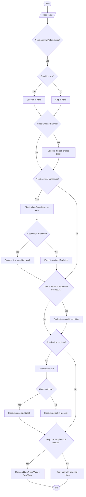

# Conditional Statements in Java

## Definition

A **conditional statement** is a control-flow statement that allows a program to make a decision. It evaluates a Boolean expression, which is either `true` or `false`, and executes code based on the result.

Conditional statements are also called **decision-making statements** because they change the normal top-to-bottom execution of a program.

### Why are conditional statements used?

- To execute code only when a condition is satisfied.
- To choose exactly one action from several alternatives.
- To handle different inputs and program situations.
- To validate values before performing an operation.

## Important Terms

| Term | Meaning |
|---|---|
| Condition | A Boolean expression that produces `true` or `false` |
| Boolean expression | An expression using values, relational operators, or logical operators |
| Branch | One possible path of execution |
| Block | A group of statements enclosed in `{}` |
| Nested condition | A conditional statement written inside another conditional statement |
| Fall-through | In a `switch`, execution continuing into the next case when `break` is missing |

## Types of Conditional Statements

Java provides these main decision-making statements:

1. `if` statement
2. `if-else` statement
3. `else-if` ladder
4. Nested `if` statement
5. `switch` statement
6. Ternary operator (`?:`), also called the conditional operator

---

## 1. `if` Statement

The `if` statement executes a block only when its condition is `true`. If the condition is `false`, the block is skipped.

### Syntax

```java
if (condition) {
	// statements executed when condition is true
}
```

### Example

```java
int age = 20;

if (age >= 18) {
	System.out.println("You are eligible to vote.");
}
```

The message is printed because `age >= 18` evaluates to `true`.

---

## 2. `if-else` Statement

The `if-else` statement chooses between two blocks. The `if` block runs when the condition is `true`; otherwise, the `else` block runs.

### Syntax

```java
if (condition) {
	// true block
} else {
	// false block
}
```

### Example

```java
int number = 7;

if (number % 2 == 0) {
	System.out.println("Even number");
} else {
	System.out.println("Odd number");
}
```

Exactly one of the two blocks executes.

---

## 3. `else-if` Ladder

An `else-if` ladder tests multiple conditions from top to bottom. The first condition that is `true` is executed, and the remaining conditions are skipped. The final `else` is optional and handles all unmatched cases.

### Syntax

```java
if (condition1) {
	// block 1
} else if (condition2) {
	// block 2
} else if (condition3) {
	// block 3
} else {
	// default block
}
```

### Example

```java
int marks = 82;

if (marks >= 90) {
	System.out.println("Grade A+");
} else if (marks >= 75) {
	System.out.println("Grade A");
} else if (marks >= 60) {
	System.out.println("Grade B");
} else {
	System.out.println("Needs improvement");
}
```

The order matters. Since `82 >= 75` is true, `Grade A` is printed and later conditions are not checked.

---

## 4. Nested `if` Statement

A nested `if` is an `if` statement inside another `if`, `else`, or `else-if` block. It is useful when a second decision depends on the first decision.

### Example

```java
int age = 25;
boolean hasId = true;

if (age >= 18) {
	if (hasId) {
		System.out.println("Entry allowed");
	} else {
		System.out.println("ID is required");
	}
} else {
	System.out.println("Entry not allowed");
}
```

The inner condition is checked only when the outer condition is `true`.

---

## 5. `switch` Statement

The `switch` statement compares one expression with multiple constant `case` labels. It is often clearer than a long `else-if` ladder when one value is being compared with fixed choices.

### Syntax

```java
switch (expression) {
	case value1:
		// statements
		break;
	case value2:
		// statements
		break;
	default:
		// no case matched
}
```

### Example

```java
int day = 2;

switch (day) {
	case 1:
		System.out.println("Monday");
		break;
	case 2:
		System.out.println("Tuesday");
		break;
	case 3:
		System.out.println("Wednesday");
		break;
	default:
		System.out.println("Invalid day");
}
```

### Important `switch` rules

- `case` values must be compatible with the switch expression and are normally constant values.
- `break` stops execution from continuing into the next case.
- `default` is optional and runs when no case matches.
- Traditional `switch` supports types such as `byte`, `short`, `char`, `int`, their wrappers, `String`, and `enum`.
- `switch` expressions and arrow-style cases are available in modern Java versions.

### Modern switch arrow syntax

```java
String result = switch (day) {
	case 1 -> "Monday";
	case 2 -> "Tuesday";
	case 3 -> "Wednesday";
	default -> "Invalid day";
};
```

Arrow cases do not fall through, so `break` is not required.

---

## 6. Ternary Operator (`?:`)

The ternary operator is a short form of `if-else`. It is best for assigning or returning one of two simple values, not for large blocks of statements.

### Syntax

```java
result = condition ? valueIfTrue : valueIfFalse;
```

### Example

```java
int number = 10;
String type = (number % 2 == 0) ? "Even" : "Odd";
System.out.println(type);
```

Equivalent `if-else` code would assign `"Even"` or `"Odd"` inside separate blocks.

## Operators Commonly Used in Conditions

### Relational operators

| Operator | Meaning | Example |
|---|---|---|
| `==` | Equal to | `a == b` |
| `!=` | Not equal to | `a != b` |
| `>` | Greater than | `a > b` |
| `<` | Less than | `a < b` |
| `>=` | Greater than or equal to | `a >= b` |
| `<=` | Less than or equal to | `a <= b` |

### Logical operators

| Operator | Meaning | Example |
|---|---|---|
| `&&` | AND; both conditions must be true | `age >= 18 && hasId` |
| `||` | OR; at least one condition must be true | `isAdmin || isOwner` |
| `!` | NOT; reverses the Boolean result | `!isClosed` |

For objects such as `String`, use `.equals()` for content comparison:

```java
String role = "admin";

if (role.equals("admin")) {
	System.out.println("Access granted");
}
```

Do not use `==` to compare String contents; `==` compares references.

## Rules and Best Practices

- The condition in an `if` statement must have type `boolean`; Java does not treat `0` or `1` as Boolean values.
- Use braces `{}` even for one statement to prevent accidental errors when code changes.
- Put more specific conditions before more general conditions in an `else-if` ladder.
- Use `switch` for a fixed set of choices and `if-else` for ranges or complex Boolean expressions.
- Keep conditions readable by using meaningful Boolean variables.
- Avoid deeply nested conditions; extract a method or simplify the logic when possible.
- Use `break` in traditional `switch` cases unless fall-through is intentional.
- Always consider boundary values, such as `0`, negative values, and the exact limit in comparisons.

## Complete Flowchart

This flowchart shows how a Java program can move through the major conditional forms: `if`, `if-else`, `else-if`, nested `if`, `switch`, and ternary selection.



## Quick Comparison

| Form | Best use | Number of outcomes |
|---|---|---|
| `if` | One optional action | Zero or one |
| `if-else` | Two alternatives | Exactly one of two |
| `else-if` ladder | Several conditions or ranges | One matching branch, or default |
| Nested `if` | Dependent decisions | Depends on inner and outer conditions |
| `switch` | Fixed values or menu choices | One matching case, or default |
| Ternary `?:` | A short two-value choice | Exactly one value |
