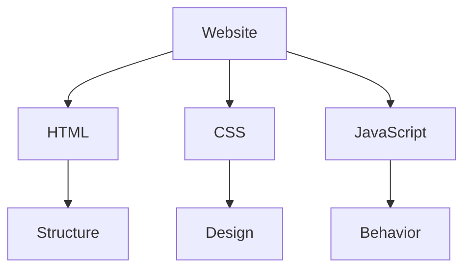

# 📘 HTML Complete Notes

## 1. HTML ka basic idea

### ✅ Definition
**HTML** = **HyperText Markup Language**

HTML ka use website ki **structure** banane ke liye hota hai.

- Heading
- Paragraph
- Image
- Link
- Button
- Form
- Table
- List

### Simple real-life example
A website ko aap ek **ghar** ki tarah socho:

- **HTML** → Ghar ki structure
- **CSS** → Ghar ka design / decoration
- **JavaScript** → Ghar ki working / behavior

> **HTML = Structure**

---

## 2. HyperText kya hota hai?

**HyperText** means text jo other pages ya resources se connect karta hai.

```html
<a href="https://example.com">Visit Website</a>
```

Jab aap is text par click karoge, to doosri page open hogi.

> **HyperText = link-based text**

---

## 3. Markup Language kya hota hai?

A **markup language** special tags use karti hai content ko explain karne ke liye.

```html
<h1>My Website</h1>
<p>This is my website.</p>
```

Yahan:

- `<h1>` = heading hai
- `<p>` = paragraph hai

**HTML** browser ko samjhata hai:

- "Ye heading hai"
- "Ye paragraph hai"
- "Ye image hai"
- "Ye link hai"

> **HTML content ko structure dene ke liye use hota hai, logic run karne ke liye nahi.**

---

## 4. Kya HTML programming language hai?

### ❌ No, HTML programming language nahi hai.

HTML ek **markup language** hai.

### Why not?
Programming language me commonly hota hai:

- Variables
- Condition
- Loops
- Functions
- Logic

HTML me aise concepts kam hote hain. HTML sirf content ko structure deta hai.

> **Interview answer:**  
> HTML ek programming language nahi hai. Yeh web page ki structure banane ke liye use hota hai.

---

## 5. HTML5 kya hai?

**HTML5** HTML ka modern version hai.

### Features
- Semantic elements
- Audio
- Video
- Canvas
- Better forms
- New input types
- Accessibility improvements

### Example
```html
<video controls>
  <source src="video.mp4" type="video/mp4">
</video>
```

---

## 6. HTML Tags kya hote hain?

Tag angle brackets `< >` ke andar hota hai.

```html
<p>
<h1>

<a>
```

### Example
```html
<p>Hello World</p>
```

Yahan:

- `<p>` = opening tag
- `Hello World` = content
- `</p>` = closing tag

---

## 7. HTML Element kya hota hai?

**HTML element** = opening tag + content + closing tag

```html
<p>Hello World</p>
```

### Important difference
- **Tag** = `<p>`
- **Element** = `<p>Hello World</p>`

---

## 8. HTML Attributes kya hote hain?

Attributes ek element ko extra information dete hain.

```html
<a href="https://example.com">Visit Website</a>
```

Yahan:

- `href` = attribute
- `https://example.com` = attribute value

### Another example
```html

```

### Syntax
```html
<tag attribute="value">
```

---

## 9. Nested Elements

Jab ek element doosre element ke andar ho, toh use **nesting** kehte hain.

```html
<div>
  <h1>My Website</h1>
  <p>Welcome to my website.</p>
</div>
```

Yahan `h1` aur `p` `div` ke andar hain.

> **Always close nested elements properly.**

Correct:
```html
<p>Hello <strong>World</strong></p>
```

---

## 10. Basic HTML document structure

### ✅ Full structure
```html
<!DOCTYPE html>
<html lang="en">
<head>
  <meta charset="UTF-8">
  <meta name="viewport" content="width=device-width, initial-scale=1.0">
  <title>My Website</title>
</head>
<body>
  <h1>Hello World</h1>
  <p>Welcome to my website.</p>
</body>
</html>
```

### Important parts explained

#### 1) `<!DOCTYPE html>`
Yeh browser ko bataata hai ki document HTML5 use kar raha hai.

> `<!DOCTYPE html>` = HTML5 ka declaration

#### 2) `<html>`
Yeh document ka root element hai.

```html
<html lang="en">
```

`lang="en"` English language ko indicate karta hai.

#### 3) `<head>`
Yeh page ki information rakhta hai, jo visible nahi hoti.

Contains:
- `<title>`
- `<meta>`
- `<link>`
- `<style>`
- `<script>`

#### 4) `<title>`
Browser tab me dikhata hai.

```html
<title>My Portfolio</title>
```

#### 5) `<body>`
Yeh visible content rakhta hai.

```html
<body>
  <h1>My Portfolio</h1>
  <p>Welcome to my portfolio.</p>
</body>
```

---

## 11. HTML Comments

Comments code me note likhne ke liye use hote hain.

```html
<!-- This is a comment -->
```

Browser comment ko display nahi karta.

### Use cases
- Code explain karna
- Team understanding
- Code temporarily disable karna

Example:
```html
<!-- Main heading -->
<h1>My Website</h1>
```

---

## 12. HTML whitespace

HTML extra spaces aur line breaks ko ignore karta hai.

```html
<p>Hello       World</p>
```

and

```html
<p>Hello World</p>
```

normally same output dikhayenge.

> Spacing ke liye CSS use karna better hota hai.

---

## 13. Case sensitivity

HTML tags generally **case-insensitive** hote hain.

```html
<P>Hello</P>
```

and

```html
<p>Hello</p>
```

same behave karte hain.

### Best practice
Always use lowercase:
```html
<h1>Hello</h1>
```

---

## 14. Block vs Inline elements

This is a very important interview topic.

### Block-level elements
Ye normally **new line** start hote hain aur puri width le lete hain.

Examples:
```html
<div>
<p>
<h1>
<section>
<header>
<footer>
```

Example:
```html
<h1>Heading 1</h1>
<p>Paragraph 1</p>
```

### Inline elements
Ye same line me rehte hain.

Examples:
```html
<span>
<a>
<strong>
<em>
```

Example:
```html
<p>Hello <strong>World</strong></p>
```

> CSS ke through display behavior change kiya ja sakta hai.

---

## 15. `<div>` element

`<div>` ek generic **block-level container** hai.

```html
<div>
  <h1>My Website</h1>
  <p>Welcome!</p>
</div>
```

Use:
- Grouping content
- Styling
- Layout

---

## 16. `<span>` element

`<span>` ek generic **inline container** hai.

```html
<p>My name is <span>Adarsh</span>.</p>
```

Use:
- Small text ko style karna
- Specific part ko target karna

---

## 17. `<div>` vs `<span>`

| Element | Default behavior | Use case |
|---------|------------------|----------|
| `<div>` | Block-level | Large sections or grouping |
| `<span>` | Inline | Small text or inline styling |

### Quick memory trick
- **div** = big block
- **span** = small inline text

---

## 18. Parent, Child and Sibling elements

```html
<div>
  <h1>My Website</h1>
  <p>Hello World</p>
</div>
```

### Structure
```text
      div
     /   \
    h1    p
```

- `div` = parent
- `h1` and `p` = children
- `h1` and `p` = siblings

---

## 19. Easy diagram to remember



### Small visual summary
```text
HTML  --> Structure of page
CSS   --> Design / Styling
JS    --> Interactivity / logic
```

---

## 20. Quick memory map

```text
HTML
  |
  +-- HyperText Markup Language
  |
  +-- Used to create webpage structure
  |
  +-- Not a programming language
  |
  +-- Tag = <p>
  |
  +-- Element = <p>Hello</p>
  |
  +-- Attribute = href, src, alt, class
  |
  +-- <head> = page info
  |
  +-- <body> = visible content
  |
  +-- <div> = block-level container
  |
  +-- <span> = inline container
```

---

## 21. Important points to remember

### ✅ HTML is used for
- Structure
- Content
- Layout
- Semantic meaning

### ✅ HTML is not for
- Logic building
- Calculations
- Complex programming

### ✅ Must remember
```html
<!DOCTYPE html>
<html>
<head>
  <title>Page Title</title>
</head>
<body>
  <h1>Hello</h1>
</body>
</html>
```

---

## 22. Interview questions with short answers

### Q1. What is HTML?
**Answer:** HTML stands for HyperText Markup Language. It is used to create the structure of web pages.

### Q2. Is HTML a programming language?
**Answer:** No, HTML is a markup language, not a programming language.

### Q3. What is an HTML tag?
**Answer:** A tag is a keyword inside angle brackets, like `<h1>` or `<p>`.

### Q4. What is an HTML element?
**Answer:** An element is a complete tag with content, like `<p>Hello</p>`.

### Q5. What is an attribute?
**Answer:** An attribute adds extra information to an element, like `href` or `src`.

### Q6. What does `<!DOCTYPE html>` do?
**Answer:** It tells the browser the document is HTML5.

### Q7. Difference between `<head>` and `<body>`?
**Answer:** `<head>` contains page information, while `<body>` contains visible page content.

### Q8. What is semantic HTML?
**Answer:** Semantic HTML uses meaningful tags like `<header>`, `<nav>`, `<main>`, and `<footer>`.

### Q9. Difference between `<div>` and `<span>`?
**Answer:** `<div>` is block-level; `<span>` is inline.

---

## 23. Practice task for you

Create a file named:

```html
index.html
```

Inside it, add:

1. Your name as `<h1>`
2. A short paragraph
3. Your favorite technology
4. An image
5. A link to a website
6. A comment
7. A `<div>` with content
8. A `<span>` around one word

---

## 24. Final revision — short summary

```text
HTML = Structure
CSS = Design
JS = Behavior

Tag -> <p>
Element -> <p>Hello</p>
Attribute -> href="..."

<head> -> information
<body> -> visible content
<div> -> block container
<span> -> inline container
```

---

## 25. One-line memory trick

> **HTML tells the browser: “What is this content?”**

This is the easiest way to remember it.

---

## ✅ Beginner-friendly takeaway

If you are new to HTML, remember these 5 things first:

1. HTML creates page structure.
2. Tags are used to write HTML.
3. Elements are tags + content.
4. Attributes provide extra information.
5. `<head>` and `<body>` are the most important major parts.

---

# Next chapter idea
**HTML Text & Formatting**

Topics you will learn next:
- `<h1>` to `<h6>`
- `<p>`
- `<strong>` and `<b>`
- `<em>` and `<i>`
- `<mark>`
- `<sub>` and `<sup>`
- `<pre>`
- `<code>`
- Quotes and entities

---

### ✨ Quick tip
Whenever you study HTML, always ask:

- What is this tag for?
- Is it block or inline?
- Is it visible content or metadata?
- What kind of content does it contain?

This will make HTML very easy to understand.
